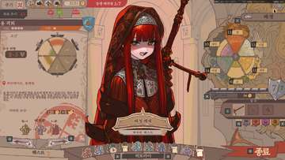

# Sovereign Tower Replacer

  

**Sovereign Tower**용 아니메 / 서브컬처풍 리플레이서 도구와 예시 에셋 모음입니다.

이 프로젝트는 *Sovereign Tower*의 캐릭터 초상화와 한국어 폰트를 교체하기 위한 도구를 제공합니다. 초상화 모드에서는 **`REPLACE/`** 폴더를 Portrait Replacer의 일괄 교체 원본 폴더로 사용합니다. 맨 위의 Victoria 이미지는 기본 스타일 예시입니다. 교체 대상은 계속 확장 중입니다.

## 포함된 도구

### Portrait Replacer 0.7.0
- 한국어 / 영어 GUI
- 캐릭터 필터와 검색
- 단일 교체 / 일괄 교체
- GDRE Tools를 통한 원본 PNG 추출
- 현재 게임에서 확인된 CTEX 형식(DXT5/BC3, WebP, PNG) 지원
- 적용 시 기존 PCK 레이아웃 유지
- 작업 전 백업 생성

### Font Replacer 0.4.0
- 한국어 / 영어 GUI
- `sovereign_tower.pck`의 한국어 NotoSansKR 리소스 교체
- Godot 4.6.2를 사용해 호환되는 `.fontdata` 생성
- 백업 / 복원 지원

## 실행
저장소를 내려받은 뒤 사용할 도구의 실행 파일을 실행합니다.

- `portrait-replacer/START.bat`
- `font-replacer/START.bat`

`START_KO.bat`, `START_EN.bat`으로 시작 언어를 지정할 수도 있습니다.

## 예시 이미지
맨 위의 Victoria 이미지를 기본 스타일 예시로 사용합니다.

## REPLACE 폴더
**`REPLACE/`** 폴더를 Portrait Replacer의 일괄 교체 원본 폴더로 사용합니다. 현재 캐릭터 / 표정 범위는 아래와 같으며 계속 추가 중입니다.

### 현재 교체 목록
- **Academician** — smiling, stoical
- **Agrand** — proud, sad, serious
- **Alwena** — worried
- **Angelica** — armored, cat, embarrassed, from behind, possessed, sad, smiling, surprised
- **Ari** — armored, curious, possessed, serious, smiling
- **Aristocrat** — disgusted, surprised
- **Arlin** — angry, calm, checking notes, cook overlay, crying, distraught, embarrassed, frightened, from behind, objecting, objecting arm, sad, smiling, surprised
- **Blacksmith** — blushing, blushing dress, blushing hammerless, disgusted, disgusted hammerless, serious, serious hammerless, sideeye, sideeye dress, sideeye hammerless, smiling, smiling dress, smiling hammerless
- **Brunhilda** — angry, armored, blushing, blushing second, from behind, pleading, possessed, sad, sarcastic, serious, sigh, smiling, surprised
- **Dragon Knight** — serious, threatening, young, young embarrassed
- **Farmer** — serious, worried
- **Gendan** — humble calm, humble worried embarrassed
- **Gideon** — angry, armored, blushing, blushing smiling, blushing sweaty, disgusted, melodramatic element 1, melodramatic element 2, possessed, serious, sigh, smiling, surprised, sweaty
- **Gwendan** — angry, disgusted, from behind, humble blushing, humble blushing smiling, humble from behind, humble possessed, humble smiling, humble surprised, humbled disgusted, possessed, smiling
- **Intendant Knight** — armored, serious
- **Intendante** — angry, serious, shouting, whispering
- **Kingslayer** — armor crumbling, intro, serious
- **Lady Tower** — blush, human blushing, human blushing smiling, human neutral, human sad, sad, serious, smiling
- **Ligia** — blushing, embarrassed, flirty, knight armored, knight embarrassed, knight flirty side eyes, knight serious, knight smiling, knight surprised curious, knight worried, possessed, serious, smiling, surprised curious, worried
- **Oliver** — armored, base possessed, embarrassed, mage armored, mage blushing, mage embarrassed, mage from behind, mage smoking, mage smiling, mage stoical, mage surprised worried, possessed, smiling, smoke, stoical, surprised worried
- **Rowan** — blush, calm, embarrassed, sideeye, smile
- **Rupin** — angry, worried, worried neutral, worried smile
- **Shadow** — default
- **Ursule** — armored, blushing, blushing side eye, corruption low neutral, from behind, high corruption armored, high corruption blushing side eye, low corruption armored, low corruption blushing, low corruption sigh, low corruption smiling, mid corruption armored, mid corruption blushing, mid corruption sigh, mid corruption smiling, neutral, sigh, smiling
- **Victoria** — armored, cringing, demonic, devilish, disgusted, from behind, sadistic, smiling, terrifying
- **Witch Belladonna** — angry, blushing, curious, flirty, serious, smiling, worried
- **Worker** — smiling, worried

## 사용법
- [English guide](docs/USAGE_EN.md)
- [한국어 사용법](docs/USAGE_KO.md)

## 참고
- 원본 게임 에셋은 포함되어 있지 않습니다.
- 교체 대상은 계속 추가 중입니다.
- 이 프로젝트는 비공식 팬 프로젝트이며 *Sovereign Tower*의 개발사 / 퍼블리셔와 관련이 없습니다.

## 라이선스
이 프로젝트는 **CC BY-NC 4.0** 조건으로 배포됩니다. 상업적 이용은 금지되며 저작자 표시가 필요합니다.
